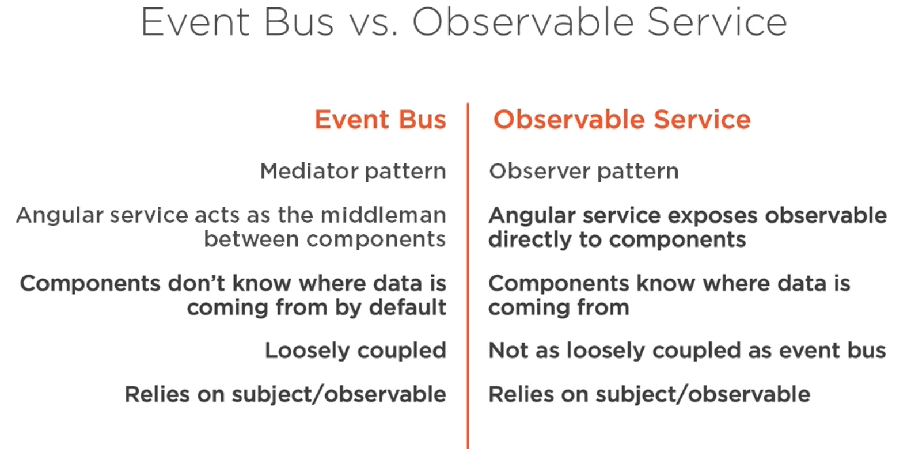
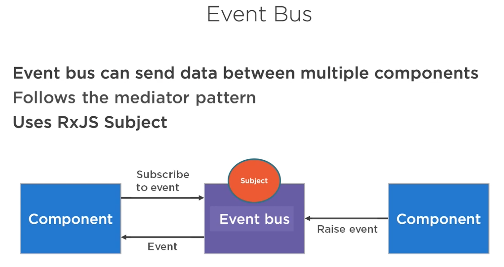
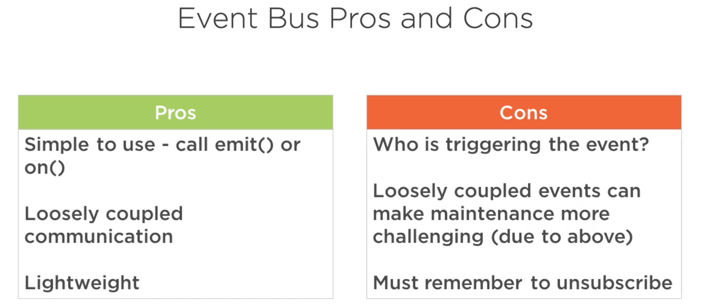
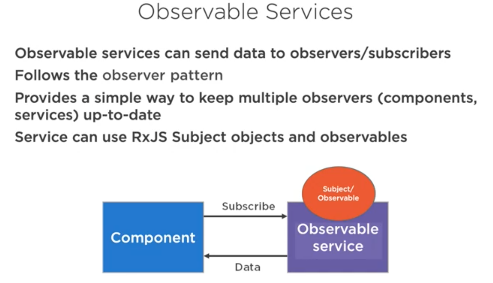
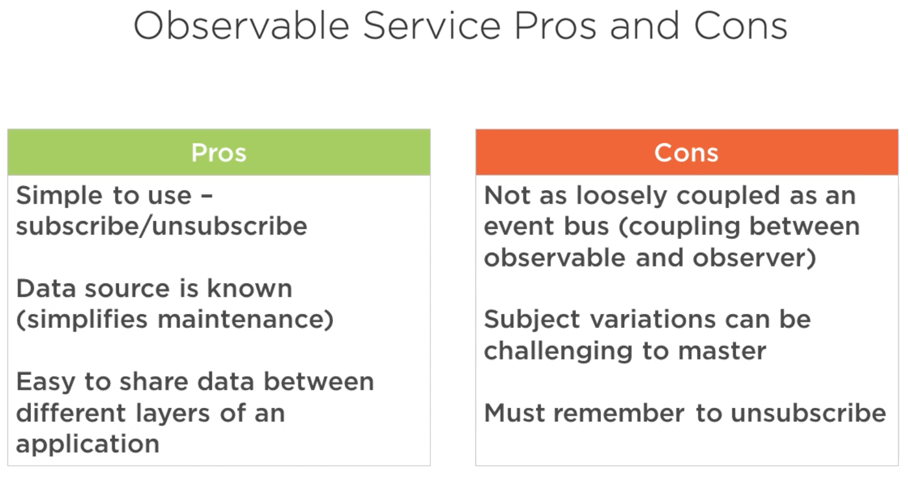
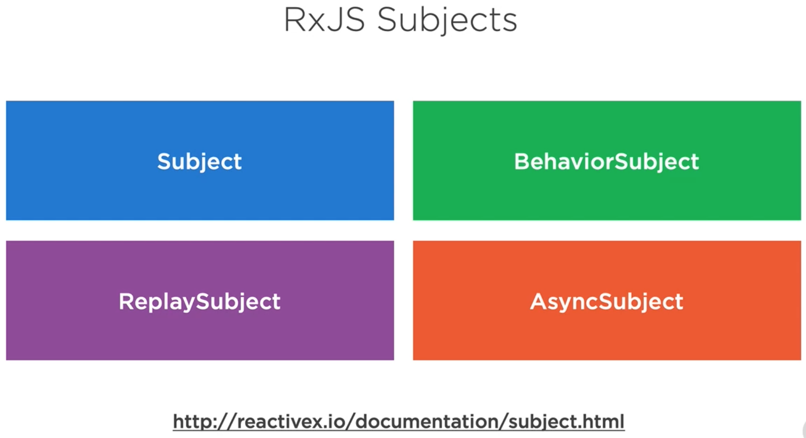
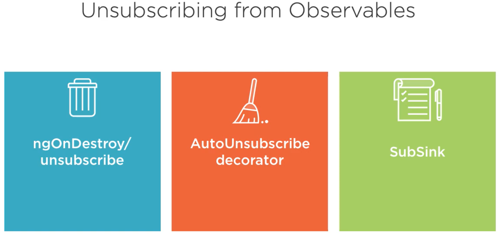

# WeatherApp

  
Netlify  
https://peaceful-villani-b1645e.netlify.app/  

Azure Static Web Application  
https://wonderful-meadow-0771eba03.azurestaticapps.net/
https://polite-island-070e90d03.azurestaticapps.net/

This project was generated with [Angular CLI](https://github.com/angular/angular-cli) version 9.1.5.

## Development server

Run `ng serve` for a dev server. Navigate to `http://localhost:4200/`. The app will automatically reload if you change any of the source files.

## Code scaffolding

Run `ng generate component component-name` to generate a new component. You can also use `ng generate directive|pipe|service|class|guard|interface|enum|module`.

## Build

Run `ng build` to build the project. The build artifacts will be stored in the `dist/` directory. Use the `--prod` flag for a production build.

## Running unit tests

Run `ng test` to execute the unit tests via [Karma](https://karma-runner.github.io).

## Running end-to-end tests

Run `ng e2e` to execute the end-to-end tests via [Protractor](http://www.protractortest.org/).

## Further help

To get more help on the Angular CLI use `ng help` or go check out the [Angular CLI README](https://github.com/angular/angular-cli/blob/master/README.md).

## EventBus Service vs Observable Service

## EventBus Service

## Observable Service

## Rxjs Subjects

with `Subject` we send data to subscribed observers, but any previously emitted data is not going to be sent as you subscribed later. You're only going to get the data that occurs after you've subscribed.  

with `BehaviorSubject`, which is one of my favorites, we can send the last piece of data to any new observers, any new subscribers. That way they can still stay in sync. They're not going to have all the previous values, but at least they'd have the latest value.  

with `ReplaySubject` we can replay everything that was previously sent. Now you can control that on how much of the data is sent, but that way any new subscribers can get all of the data that might have gone out to other components if you have that type of scenario.  

with `AsyncSubject`, as mentioned, emits the last value, and only the last value, to subscribers or observers when the sequence of data that's being sent out is actually completed.  

Now the two of these four that I find myself personally using the most are subject and BehaviorSubject. And as mentioned, `BehaviorSubject` really is a type of ReplaySubject.  

## Unsubscribe Methods

